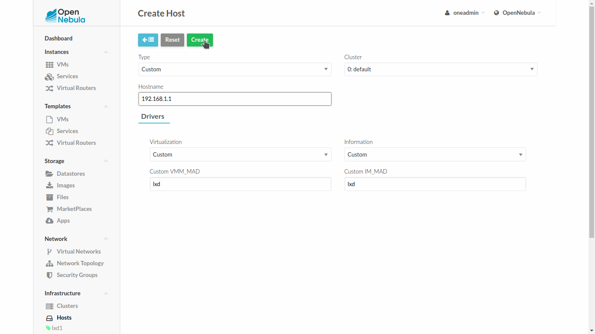
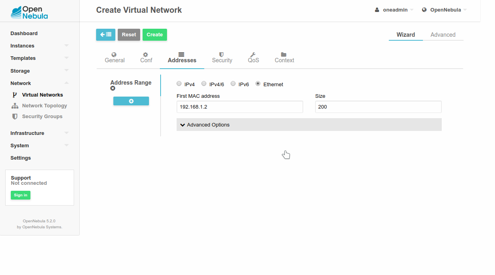

# Installation & Configuration Guide
The purpose of this guide is to create a fully functional working environment. You will be able to manage **LXD** containers in at least one virtualization node through the web interface in the frontend. For the list of supported features see [Readme](https://github.com/OpenNebula/addon-lxdone/blob/master/README.md#features).

## Observations & Recommendations
-   Read ***Notes*** sections attached to some steps, before using the shell
-   Access to [LXD image repository](https://images.linuxcontainers.org/images) is required for some container creation methods when downloading a Linux filesystem tarball.

## Table of Contents

<!-- MarkdownTOC -->

- 1 - Frontend setup
    - 1.1 Installation
    - 1.2 LXDoNe integration
- 2 - Virtualization Node setup
    - 2.1 Install required packages
    - 2.2 VNC server \(optional\)
    - 2.3 LXD Bridge \(optional\)
    - 2.4 oneadmin
    - 2.5 Loop devices
    - 2.6 LXD
    - 2.7 Log
- 3 - Virtual Appliance
- 4 - Usage
    - 4.1 Image Upload
    - 4.2 Virtualization node
    - 4.4 Virtual network
    - 4.5 Template creation
    - 4.6 Deploy

<!-- /MarkdownTOC -->


# 1 - Frontend setup

## 1.1 Installation

Follow [OpenNebula Deployment Guide](https://docs.opennebula.org/5.2/deployment/opennebula_installation/frontend_installation.html) to deploy a full functional OpenNebula frontend.

<!-- ## 1.2 Logs
If you are deploying ***oneadmin ALL= NOPASSWD: ALLfrontend*** and ***virtualization node*** in the same computer you can skip this step. ***Virtualization Driver*** execution information is written directly in the corresponding virtual machine log in the ***frontend***, we'll need to export the log folder through **NFS** in order to mount it in the ***virtualization node***.

Install and configure an NFS server on the computer where the frontend is installed and configure it to export /var/log/one.

```
# apt install nfs-kernel-server
# echo -e "/var/log/one/ *(rw,sync,no_subtree_check,no_root_squash,crossmnt,nohide)" >> /etc/exports
```

<a name="13-enable-lxd"></a> 

### 1.2 Enable LXD
-->

## 1.2 LXDoNe integration
**LXDoNe** is a set of scripts functioning as virtualization and monitorization drivers, so they have to be integrated to the ***frontend*** 

<a name="141-drivers"></a>
### 1.2.1 Drivers

Copy scripts to oneadmin drivers directory: 

```
cp -rpa addon-lxdone-master/src/remotes/ /var/lib/one/
```

Set the appropriate permissions

```
sudo cd /var/lib/one/remotes/
sudo chown -R oneadmin:oneadmin vmm/lxd im/lxd*
sudo chmod 755 -R vmm/lxd im/lxd*
sudo chmod 644 im/lxd.d/collectd-client.rb
```

<a name="1411-optional-add-support-for-8021q-driver-vlans"></a>
### 1.2.1.1 Optional. Add support for 802.1Q driver (VLANs).
Replace /var/lib/one/remotes/vnm.rb file.

```
cp -rpa addon-lxdone-master/src/one_wait/nic.rb /var/lib/one/remotes/vnm/nic.rb
sudo chown oneadmin:oneadmin /var/lib/one/remotes/vnm/nic.rb
sudo chmod 755 /var/lib/one/remotes/vnm/nic.rb
```

#### Note:
> A pull request will be made to add this functionality to OpenNebula's official Network Driver.


<a name="142-enable-lxd"></a>
### 1.2.2 Enable LXD

Modify /etc/one/oned.conf.
Under **Information Driver Configuration** add this:

```
#-------------------------------------------------------------------------------
# lxd Information Driver Manager Configuration
# -r number of retries when monitoring a host
# -t number of threads, i.e. number of hosts monitored at the same time
#-------------------------------------------------------------------------------
IM_MAD = [ NAME = "lxd",
EXECUTABLE = "one_im_ssh",
ARGUMENTS = "-r 3 -t 15 lxd" ]
#-------------------------------------------------------------------------------
```

Under **Virtualization Driver Configuration** add this:

```
#-------------------------------------------------------------------------------
# lxd Virtualization Driver Manager Configuration
# -r number of retries when monitoring a host
# -t number of threads, i.e. number of actions performed at the same time
#-------------------------------------------------------------------------------
VM_MAD = [ NAME = "lxd",
EXECUTABLE = "one_vmm_exec",
ARGUMENTS = "-t 15 -r 0 lxd",
KEEP_SNAPSHOTS = "yes",
TYPE = "xml",
IMPORTED_VMS_ACTIONS = "migrate, live-migrate, terminate, terminate-hard, undeploy, undeploy-hard, hold, release, stop, suspend, resume, delete, delete-recreate, reboot, reboot-hard, resched, unresched, poweroff, poweroff-hard, disk-attach, disk-detach, nic-attach, nic-detach, snap-create, snap-delete"]
#-------------------------------------------------------------------------------

```

# 2 - Virtualization Node setup

Follow [KVM Node Installation](https://docs.opennebula.org/5.2/deployment/node_installation/kvm_node_installation.html#), up to [step 6](https://docs.opennebula.org/5.2/deployment/node_installation/kvm_node_installation.html#step-6-storage-configuration). If you want to use Ceph to store Virtual Images, follow [Ceph Datastore Guide](https://docs.opennebula.org/5.2/deployment/open_cloud_storage_setup/ceph_ds.html) and configure it just as you would for KVM.

## 2.1 Install required packages

```
sudo apt install lxd lxd-tools criu bridge-utils python-pylxd python-ws4py python-pip
```

#### Notes:
<!-- 
> **nfs-common** can be ignored if you are setting up the ***frontend*** and the ***virtualization node*** in the same computer.
 -->
> Be sure to have **pylxd 2.0.5**, or the driver **won't work properly**. Check the last output of the command below. You can find it on xenial-updates official repositories.

```
sudo apt show python-pylxd | grep 2.0.5 | grep 2.0.5
```

Install isoparser by pip
```
sudo pip install isoparser
```

## 2.2 VNC server (optional)
**LXDoNe** uses **svncterm** by **dealfonso@github** as **VNC** server. This package enables the **VNC** option in the VM template definition. It's already compiled for Ubuntu 16.04. Install the required dependencies from repositories.

```
sudo dpkg -i addon-lxdone-master/svncterm_1.2-1ubuntu_amd64.deb
```

## 2.3 LXD Bridge (optional)
**LXD** comes by default with an optional bridge called **lxdbr0**, it offers ease of use for containers networking and provides DHCP suport. We can use this bridge alternative configuration to standard OpenNebula networking:

```
sudo echo -e " USE_LXD_BRIDGE="true" \n
LXD_BRIDGE="lxdbr0" \n
UPDATE_PROFILE="true" \n
LXD_CONFILE="" \n
LXD_DOMAIN="lxd" \n
LXD_IPV4_ADDR="192.168.1.1" \n
LXD_IPV4_NETMASK="255.255.255.0" \n
LXD_IPV4_NETWORK="192.168.1.1/24" \n
LXD_IPV4_DHCP_RANGE="192.168.1.2,192.168.1.254" \n
LXD_IPV4_DHCP_MAX="252" \n
LXD_IPV4_NAT="true" \n
LXD_IPV6_ADDR="" \n
LXD_IPV6_MASK="" \n
LXD_IPV6_NETWORK="" \n
LXD_IPV6_NAT="false" \n
LXD_IPV6_PROXY="false" " > /etc/default/lxd-bridge
# service lxd-bridge restart
```

## 2.4 oneadmin

Allow oneadmin to execute commands as root and add it to lxd group

```
sudo echo "oneadmin ALL= NOPASSWD: ALL" >> /etc/sudoers
sudo adduser oneadmin lxd
```

## 2.5 Loop devices

Every file system image used by **LXDoNe** will require one ***loop device***. The default limit for ***loop devices*** is 8, so it needs to be increased.

```
sudo echo "options loop max_loop=128" >> /etc/modprobe.d/local-loop.conf
sudo echo "loop" >> /etc/modules
sudo depmod
```

## 2.6 LXD

<a name="261-daemon"></a>
### 2.6.1 Daemon
This is the daemon configuration we'll use

```
sudo lxd init --auto \
--storage-backend dir \
--network-address 0.0.0.0 \
--network-port 8443 \
--trust-password password
```

<a name="262-lxd-profile"></a>
### 2.6.2 LXD Profile
Containers inherit properties from a profile.

#### 2.6.2.1 Network
The default profile contains a network device, we'll remove this one as it's not managed by OpenNebula.

```
sudo lxc profile device remove default eth0
```

#### 2.6.2.2 Security
We will use privileged containers

```
sudo lxc profile set default security.privileged true
```

<!-- #### 2.6.2.3 Context (Optional)
OpenNebula Contextualization works with an iso in the VM definition template, by default containers aren't allowed to mount iso9660 files

```
sudo lxc profile set default raw.apparmor 'mount fstype=iso9660,'
```

## 2.7 Log
This step can be ignored if you are setting up the ***frontend*** and the ***virtualization node*** in the same computer. Mount the exported logs in the frontend in the node.

```
sudo mkdir -p /var/log/one
sudo echo -e "frontend_ip:/var/log/one/ /var/log/one/ nfs soft,intr,rsize=32768,wsize=32768,auto" >> /etc/fstab
# mount /var/log/one/
```
 -->
# 3 - Virtual Appliance

#### Note:
We've uploaded a base container to [google drive](http://https://drive.google.com/uc?export=download&confirm=FkpQ&id=0B97YSqohwcQ0bTFRUE5RMmphT1U), if you succesfully download it skip the rest of this step, as it could be rather troublesome. Recently we added a virtual appliance to the [marketplace](https://marketplace.opennebula.systems/appliance/7dd50db7-33c4-4b39-940c-f6a55432622f).

After creating a virtual appliance you'll have a steady container base image for infrastructure. For the sake of setup simplicity, as this process is usually done once, it is covered in [Virtual Appliance](Image.md). If you have a container you want to use follow the link too.

# 4 - Usage
This is a set of basic usage, there are lots of extra features to use. For the list of supported features see [Readme](README.md).

## 4.1 Image Upload

Upload the Virtual Appliance to OpenNebula.

<a name="required-data"></a>
### Required data:
* Name.
* Type. Select Operating System image.
* Image Location.


## 4.2 Virtualization node

<a name="required-data-1"></a>
### Required data:
* Type. Select Custom.
* Name
* Under Drivers
* Virtualization. Select Custom.
* Information. Select Custom.
* Custom VMM_MAD. Enter lxd.
* Custom IM_MAD. Enter lxd.



## 4.4 Virtual network

<a name="required-data-2"></a>
### Required data:
* General:
* Name.
* Conf:
* Bridge. **br0** or **lxdbr0** in this case.
* Addresses:
* Select **IPv4** if using **br0**, **Ethernet** if using **lxdbr0** or an external **DHCP** service
* First **IP/MAC address**.
* Size.



## 4.5 Template creation

<a name="required-data-3"></a>
### Required data:
* General:
* Name
* Memory (ex. 32MB)
* CPU (ex. 0.1)
* VCPU (optional ex. 1)
* Storage:
* Select on Disk 0 the Virtual Appliance (You mustn't set as Disk 0 a non OS image)
* Network (optional):
* Select one or many network interfaces. They will appear inside the container configured.
* Input/Output (optional work in progress)
* Select **VNC** under graphics.


#### Note
> VCPU stands for the amount of cores the container can use, if the container if you leave it blank, the container will use all the cores up to a fraction defined by CPU.
> ex. for a host with 8 CPUs, if the VM template states 2 VCPU, then the container has 2/8 CPUs allocated.

## 4.6 Deploy
Click **Instances** --> **VMs** --> **ADD**.
Select the corresponding template and click **Create**. Then wait for the scheduler to execute the drivers. In the Log section there will be additional information like the time spent on executing actions scripts and errors if they occur.


Also if you want to use VNC, the graphic session will start in the root prompt inside the container. noVNC should look like this:

